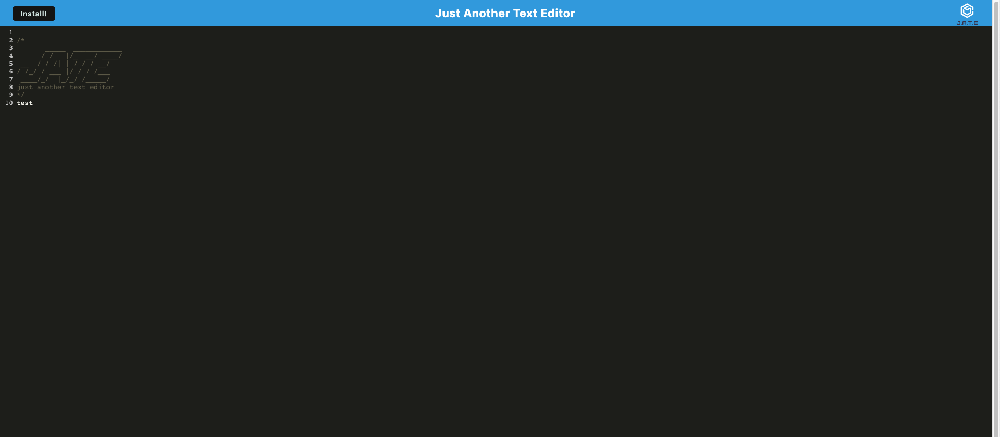

# PWA Text Editor

## Description
A simple text editor that can be used offline. It is a PWA (Progressive Web App) and can be installed on your device. 
Utilizes IndexedDB to store data locally, webpack to bundle the files, and service workers to cache the files for offline use.

## Table of Contents

* [Installation](#installation)
* [Usage](#usage)
* [Screenshot](#screenshot)
* [License](#license)
* [Questions](#Questions)
* [Email](#Email)
* [Github](#Github)
* [Owner](#Owner)

## Installation
This application uses Node.js and various npm packages so you will need to install node and then run ```npm i``` in the terminal at the root of the directory to install the dependencies.

## Usage
After installing Node.js and running ```npm i``` in the terminal at the root directory, you will now run ```npm run start``` in the terminal at the root of the directory to launch the application. You can then navigate to localhost:3001 or localhost:3000 in your browser to use the application. You can also install the application on your device by clicking the install button in the address bar of your browser.

## Screenshot:


## License
This project is licensed under the MIT license. Click [here](https://opensource.org/licenses/MIT) for more information.<br>


## Questions:
## Email:
If you have any questions email me directly at domenicoabarberi@gmail.com.

## Github:
Please visit my [GitHub](https://github.com/DomenicoBarb) to view my other work.

## Owner:
Nico Barberi